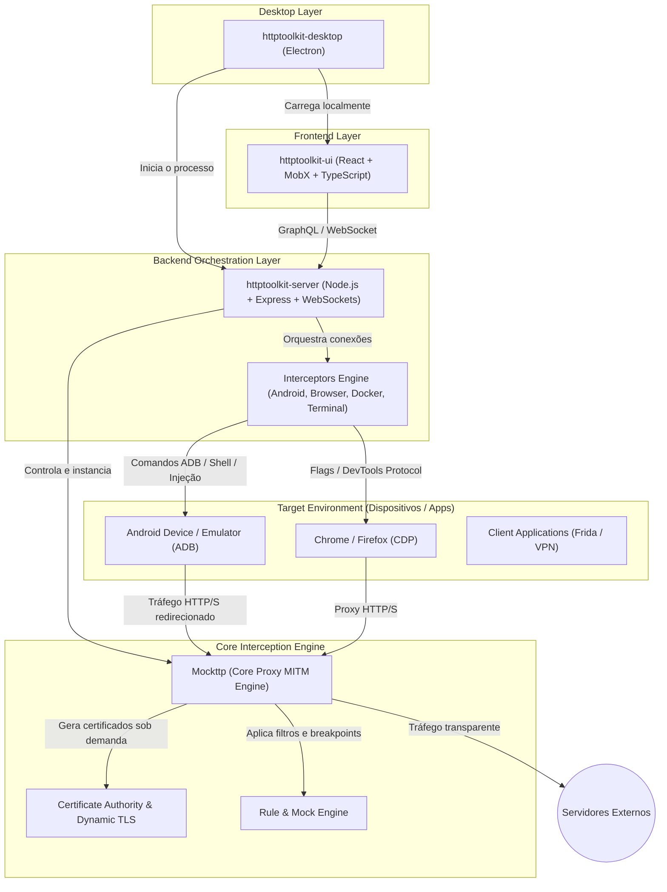

# Estudo Arquitetural: HTTP Toolkit & Guia de Desenvolvimento para o Mobile Element Recorder

Este documento apresenta um estudo aprofundado sobre a ferramenta **HTTP Toolkit**, sua arquitetura modular interna e suas técnicas de interceptação de tráfego de rede (especialmente em dispositivos móveis Android e iOS). Ao final, é apresentado um guia técnico de desenvolvimento que detalha como reproduzir essa arquitetura e integrá-la diretamente ao nosso projeto [Mobile Element Recorder (`epic-fermi`)](file:///Users/francisco.junior/Documents/antigravity/epic-fermi/README.md).

---

## 1. Contexto do Nosso Projeto (`epic-fermi`)

Antes de analisar o HTTP Toolkit, é fundamental compreender o estágio e a arquitetura do nosso projeto atual:

### O que o `epic-fermi` faz hoje
O **Mobile Element Recorder** é uma ferramenta desktop desenvolvida em Python/Tkinter voltada para automação de testes mobile:
- **Espelhamento em Tempo Real:** Captura o fluxo de tela de emuladores/dispositivos Android via ADB (`exec-out screencap`) e simuladores iOS via WebDriverAgent ([`stream_engine.py`](file:///Users/francisco.junior/Documents/antigravity/epic-fermi/recorder/stream_engine.py)).
- **Detecção de Dispositivos e Automação:** Gerencia conexões e comandos nativos através de subprocessos no [`adb_bridge.py`](file:///Users/francisco.junior/Documents/antigravity/epic-fermi/recorder/adb_bridge.py) e endpoints REST no [`ios_bridge.py`](file:///Users/francisco.junior/Documents/antigravity/epic-fermi/recorder/ios_bridge.py).
- **Escuta Passiva de Eventos:** Intercepta toques físicos na tela via `getevent` no Android e Quartz no macOS ([`passive_listener.py`](file:///Users/francisco.junior/Documents/antigravity/epic-fermi/recorder/passive_listener.py)).
- **Inspeção de Hierarquia de UI:** Realiza o parse de árvores XML (`uiautomator dump` e WDA XML) calculando caixas delimitadoras e elementos clicáveis ([`element_parser.py`](file:///Users/francisco.junior/Documents/antigravity/epic-fermi/recorder/element_parser.py)).
- **Geração de Código Appium:** Gera classes Page Object e ações de clique (`self.click(...)`, `self.click_at_position(...)`) baseadas em estratégias de ID, XPath e coordenadas ([`codegen.py`](file:///Users/francisco.junior/Documents/antigravity/epic-fermi/recorder/codegen.py)).

### A Oportunidade: Por que estudar o HTTP Toolkit?
No ciclo de testes de aplicações móveis, **a interface visual (UI) é apenas metade da equação**. Quando um usuário toca em um botão na tela:
1. Uma requisição HTTP/HTTPS de API ou Analytics é disparada em segundo plano.
2. A resposta do backend altera o estado da tela (sucesso, erro, dados dinâmicos).
3. Muitas falhas de automação ocorrem por instabilidade de rede, atrasos em endpoints ou dados inesperados.

O **HTTP Toolkit** é a referência máxima em engenharia de automação para interceptação de tráfego de rede direcionada (targeted interception), com soluções pioneiras para Android via ADB, injeção de certificados em partições somente-leitura e bypass de Certificate Pinning com Frida. Incorporar esses conceitos ao `epic-fermi` permite que o nosso gravador registre não apenas a ação de tela, mas também os **contratos de API associados**, gerando mocks e asserções completas para Appium e testes de integração.

---

## 2. O Que É e o Que Faz o HTTP Toolkit

O **HTTP Toolkit** (criado por Tim Perry) é uma suíte open-source para depuração, interceptação, inspeção e mocking de tráfego HTTP e HTTPS em tempo real. Diferente de farejadores passivos de pacotes (como Wireshark) ou proxies genéricos complexos (como Charles Proxy ou Fiddler), o HTTP Toolkit foi projetado com foco em **interceptação direcionada com zero configuração (Zero-Config Targeted Interception)**.

### Principais Capacidades:
1. **Interceptação com 1 Clique por Alvo (Zero-Config):**
   - Em vez de alterar o proxy global do sistema operacional (o que gera ruído de outros apps e pode quebrar conexões), ele abre instâncias isoladas ou configura alvos específicos: abas do Chrome com proxy isolado, terminais com variáveis de ambiente injetadas, contêineres Docker específicos e dispositivos Android via ADB.
2. **Inspeção Profunda de Tráfego:**
   - Decodifica HTTPS automaticamente, suportando HTTP/1.1, HTTP/2 e WebSockets.
   - Apresenta cabeçalhos, query strings, corpos formatados (JSON, XML, HTML, hex, multipart/form-data) e métricas de latência.
3. **Mocking e Manipulação em Tempo Real:**
   - Cria regras para interceptar requisições específicas e responder com mocks customizados, forçar erros (ex: 500 Internal Server Error, timeouts, conexões resetadas) ou pausar a requisição como um breakpoint para edição manual antes do envio ao servidor.
4. **Resolução de Segurança SSL/TLS:**
   - Gera uma Autoridade Certificadora (CA) raiz própria e emite certificados folha dinâmicos para cada domínio acessado.
   - No Android, injeta a CA no trust store do sistema e injeta scripts Frida para contornar Certificate Pinning e Certificate Transparency.

---

## 3. Arquitetura Modular do HTTP Toolkit

O HTTP Toolkit é estruturado em uma arquitetura de múltiplos repositórios altamente desacoplada:



### Detalhamento dos Componentes

#### 1. `mockttp` (O Motor Central de Proxy MITM)
- **O que é:** Uma biblioteca autônoma em TypeScript/Node.js desenvolvida para atuar como proxy MITM e servidor de mock programável.
- **Responsabilidade:**
  - Abre um socket TCP escutando conexões HTTP/HTTPS.
  - No handshake TLS (`CONNECT` tunnel), ele intercepta o SNI (*Server Name Indication*), consulta seu `CertificateManager` interno e gera em tempo de execução um certificado X.509 assinado pela CA local para o domínio requisitado.
  - Permite encadear regras declarativas: `.forGet("/api/v1/user").thenReply(200, JSON.stringify({...}))`.
  - Suporta streaming de streams binárias de requisição e resposta diretamente para a camada consumidora.

#### 2. `httptoolkit-server` (O Orquestrador de Backend)
- **O que é:** O servidor de controle local que atua como ponte entre a interface do usuário e o sistema operacional.
- **Responsabilidade:**
  - Gerencia o ciclo de vida das instâncias do `mockttp`.
  - Expõe uma API de controle em GraphQL e WebSockets para o frontend.
  - Contém o diretório `src/interceptors/`, onde reside a inteligência de injeção para cada plataforma:
    - `android/`: Scripts ADB, montagem de certificados e injeção do APK interceptor.
    - `frida/`: Injeção de scripts no runtime de processos para anular SSL pinning.
    - `terminal/`: Criação de subshells configurados com `HTTP_PROXY`, `NODE_EXTRA_CA_CERTS`, etc.
    - `browser/`: Inicialização de navegadores via Chromium DevTools Protocol (CDP) com flags de certificado e proxy apontados para o `mockttp`.

#### 3. `httptoolkit-ui` (O Painel de Controle)
- **O que é:** Uma Single Page Application (SPA) construída em React, MobX e Styled Components.
- **Peculiaridade:** É 100% desacoplada do backend. Você pode acessar a interface via navegador (`app.httptoolkit.tech`) e ela irá se conectar via `localhost` ao `httptoolkit-server` em execução na sua máquina.

#### 4. `httptoolkit-desktop` (O Wrapper de Distribuição)
- **O que é:** Um empacotador Electron.
- **Responsabilidade:** Garante a distribuição executável para macOS, Windows e Linux, gerenciando o ciclo de vida do processo Node.js do servidor em background e abrindo a janela da UI.

---

## 4. Mergulho Profundo: Como o HTTP Toolkit Intercepta o Android

O mecanismo de interceptação Android do HTTP Toolkit é uma das suas maiores inovações de engenharia reversa e segurança, sendo diretamente aplicável ao nosso contexto com [`adb_bridge.py`](file:///Users/francisco.junior/Documents/antigravity/epic-fermi/recorder/adb_bridge.py).

### O Desafio Histórico do Android
- **Android 7+ (Nougat):** Aplicativos deixaram de confiar em certificados instalados pelo usuário por padrão. Eles confiam apenas no Trust Store do Sistema (`/system/etc/security/cacerts/`).
- **Android 10+:** A partição `/system` passou a ser montada como somente leitura (`read-only`) com proteções dm-verity, impedindo gravações simples mesmo com root.
- **Android 14+:** O Android migrou o motor de criptografia para um módulo APEX atualizável (`/apex/com.android.conscrypt/cacerts/`), que utiliza namespaces de montagem isolados por processo (`mount namespaces`), impossibilitando que alterações na partição afetem aplicativos já inicializados pelo Zygote.

### A Solução do HTTP Toolkit: Injeção de CA via `tmpfs` e `nsenter`

Em vez de tentar remontar `/system` como leitura/escrita (o que frequentemente trava o aparelho ou falha), o HTTP Toolkit executa uma sequência de comandos via ADB que cria um sistema de arquivos temporário em memória RAM:

1. **Geração do Hash do Certificado:**
   Calcula o hash do certificado da CA no formato exigido pelo Android (`openssl x509 -inform PEM -subject_hash_old -in ca.pem | head -n 1`), resultando em algo como `c8450d0d.0`.
2. **Transferência do Certificado:**
   Envia o certificado para um diretório temporário no dispositivo:
   ```bash
   adb push ca.pem /data/local/tmp/c8450d0d.0
   ```
3. **Cópia e Sobreposição via `tmpfs`:**
   O script cria uma pasta temporária, copia todos os certificados oficiais existentes do sistema para ela, injeta o certificado do HTTP Toolkit, monta um sistema `tmpfs` (em memória) sobre `/system/etc/security/cacerts` e move os arquivos de volta com permissões `644` e contexto SELinux `u:object_r:system_file:s0`.
4. **Propagação para Namespaces no Android 14+ (`nsenter`):**
   No Android 14+, para que novos apps e os processos derivados do Zygote vejam o certificado sem reiniciar o aparelho:
   ```bash
   # Itera sobre os PIDs ativos e injeta a montagem no namespace de cada processo
   for PID in $(pidof zygote zygote64); do
       nsenter --mount=/proc/$PID/ns/mnt -- mount --bind /data/local/tmp/cacerts /apex/com.android.conscrypt/cacerts
   done
   ```
5. **Vantagem Absoluta:** O processo é não-destrutivo. Ao reiniciar o dispositivo, o sistema de arquivos em RAM é descartado, retornando o sistema operacional ao estado de fábrica limpo.

### Redirecionamento de Tráfego: `adb reverse` e VPN Local
- **Proxying Automático:** O HTTP Toolkit roda um comando `adb reverse tcp:8000 tcp:8000`. Isso faz com que requisições enviadas para `localhost:8000` de dentro do dispositivo Android sejam roteadas diretamente para o proxy na máquina host via cabo USB.
- **App Interceptor VPN:** Para apps que ignoram as configurações de proxy HTTP padrão do Android, o HTTP Toolkit instala um APK (`android-interceptor`) via ADB que cria uma VPN local no dispositivo. Essa VPN captura todos os pacotes das portas 80 e 443 e os redireciona via tunelamento para a porta reversa do proxy.

### Bypass de Certificate Pinning com Frida
Muitos aplicativos (bancários, redes sociais, fintechs) implementam **Certificate Pinning** (validação manual de hash de chave pública codificada no binário).
- O HTTP Toolkit embute scripts em Javascript injetados via **Frida Gadget** ou **Frida Server**:
  - Hooking de classes como `javax.net.ssl.TrustManagerImpl`, `okhttp3.CertificatePinner`, e métodos nativos de bibliotecas SSL (como BoringSSL).
  - O script intercepta a função de validação e força um retorno `true` (sucesso), permitindo a inspeção de tráfego de qualquer app protegido.

---

## 5. Como Desenvolver uma Ferramenta Semelhante

Se quisermos construir uma ferramenta de interceptação como o HTTP Toolkit ou integrar essa capacidade ao nosso gravador, os 5 componentes técnicos necessários são:

### Passo 1: O Proxy MITM e o Gerenciador de Certificados
Você precisa de um servidor proxy capaz de interceptar requisições HTTP e túneis TLS.

**Como funciona a geração dinâmica de certificados TLS:**
1. Crie uma CA raiz local (`rootCA.key` e `rootCA.crt`).
2. Quando um cliente faz um `CONNECT api.exemplo.com:443`:
   - O proxy aceita a conexão TCP com o cliente.
   - O proxy lê o ClientHello TLS e extrai o nome do host do cabeçalho SNI (`api.exemplo.com`).
   - O proxy gera sob demanda um par de chaves e um certificado X.509 com `SubjectAlternativeName: DNS:api.exemplo.com`, assinado pela sua CA raiz.
   - O proxy completa o handshake TLS com o cliente fingindo ser o servidor de destino.
   - Simultaneamente, o proxy abre um socket TLS legítimo com o servidor real `api.exemplo.com` e encaminha a requisição, permitindo a leitura em texto puro do payload.

*Em Python, podemos implementar essa camada de forma robusta e assíncrona utilizando a biblioteca `mitmproxy` (que possui APIs prontas para extensão e escuta em Python).*

### Passo 2: O Orquestrador de Dispositivos (Device Injector)
Integrar a automação de setup de rede diretamente com o nosso [`adb_bridge.py`](file:///Users/francisco.junior/Documents/antigravity/epic-fermi/recorder/adb_bridge.py):
1. **Configuração de Proxy via Shell ADB:**
   ```bash
   adb shell settings put global http_proxy 127.0.0.1:8000
   ```
2. **Reverse Port Forwarding:**
   ```bash
   adb reverse tcp:8000 tcp:8000
   ```
3. **Limpeza ao finalizar a sessão:**
   ```bash
   adb shell settings put global http_proxy :0
   adb reverse --remove tcp:8000
   ```

### Passo 3: O Sistema de Regras e Mocks
Desenvolver um motor de regras que avalia cada requisição que passa pelo proxy antes de enviá-la à internet:
- **Match Criteria:** Método HTTP, Regex de URL, Cabeçalhos presentes.
- **Action Handler:**
  - *PassThrough:* Envia para o servidor real e retorna a resposta.
  - *Mock:* Interrompe a requisição e retorna um JSON fake pré-configurado.
  - *Rewrite:* Altera um header (ex: injeta token de autenticação de teste) ou modifica o corpo da requisição.

### Passo 4: Pipeline de Eventos e IPC (Streaming para a UI)
Para que a interface gráfica atualize em tempo real com as requisições que ocorrem durante o uso do app:
- O proxy MITM emite eventos a cada requisição iniciada e finalizada (`request_started`, `response_completed`).
- Os eventos trafegam por uma fila segura de threads (`queue.Queue` em Python) para o loop principal da UI.

---

## 6. Proposta de Integração no `epic-fermi`

Abaixo apresentamos a arquitetura proposta para integrar essas funcionalidades ao nosso projeto atual sem quebrar a estrutura existente.

### 1. Novo Módulo: `recorder/network_interceptor.py`
Podemos criar um serviço que roda o proxy MITM em segundo plano e expõe uma API simples para o nosso app Tkinter.

```python
"""
Exemplo de implementação arquitetural para recorder/network_interceptor.py
Utiliza o ecossistema mitmproxy em background para capturar requisições mobile.
"""
from dataclasses import dataclass
import threading
import queue
from typing import Optional, Callable
from mitmproxy import http
from mitmproxy.options import Options
from mitmproxy.tools.dump import DumpMaster

@dataclass
class NetworkEvent:
    timestamp: float
    method: str
    url: str
    status_code: int
    request_headers: dict
    request_body: bytes
    response_headers: dict
    response_body: bytes

class InterceptorAddon:
    def __init__(self, event_queue: queue.Queue):
        self.event_queue = event_queue

    def response(self, flow: http.HTTPFlow):
        """Disparado quando uma resposta é completada."""
        event = NetworkEvent(
            timestamp=flow.response.timestamp_end or flow.request.timestamp_start,
            method=flow.request.method,
            url=flow.request.url,
            status_code=flow.response.status_code,
            request_headers=dict(flow.request.headers),
            request_body=flow.request.content or b"",
            response_headers=dict(flow.response.headers),
            response_body=flow.response.content or b""
        )
        self.event_queue.put(event)

class MobileNetworkProxy:
    def __init__(self, port: int = 8082):
        self.port = port
        self.event_queue = queue.Queue()
        self.master: Optional[DumpMaster] = None
        self._thread: Optional[threading.Thread] = None

    def start(self):
        opts = Options(listen_host="127.0.0.1", listen_port=self.port)
        self.master = DumpMaster(opts)
        self.master.addons.add(InterceptorAddon(self.event_queue))
        
        self._thread = threading.Thread(target=self.master.run, daemon=True)
        self._thread.start()

    def stop(self):
        if self.master:
            self.master.shutdown()
```

### 2. Extensão do [`adb_bridge.py`](file:///Users/francisco.junior/Documents/antigravity/epic-fermi/recorder/adb_bridge.py)
Adicionar ao `ADBBridge` métodos para automatizar o roteamento de tráfego do dispositivo conectado:

```python
def setup_reverse_proxy(self, device_id: str, proxy_port: int = 8082) -> bool:
    """Configura adb reverse e proxy global no Android."""
    try:
        # Cria tunelamento reverso da porta do proxy
        self._run_cmd(["-s", device_id, "reverse", f"tcp:{proxy_port}", f"tcp:{proxy_port}"])
        # Define o proxy do sistema apontando para o localhost do dispositivo
        self._run_cmd(["-s", device_id, "shell", "settings", "put", "global", "http_proxy", f"127.0.0.1:{proxy_port}"])
        return True
    except Exception:
        return False

def teardown_reverse_proxy(self, device_id: str, proxy_port: int = 8082) -> None:
    """Restaura as configurações de rede do Android."""
    try:
        self._run_cmd(["-s", device_id, "shell", "settings", "put", "global", "http_proxy", ":0"])
        self._run_cmd(["-s", device_id, "reverse", "--remove", f"tcp:{proxy_port}"])
    except Exception:
        pass
```

### 3. Sinergia no [`codegen.py`](file:///Users/francisco.junior/Documents/antigravity/epic-fermi/recorder/codegen.py): Gravação Unificada (UI + API)
Ao escutar os toques via [`passive_listener.py`](file:///Users/francisco.junior/Documents/antigravity/epic-fermi/recorder/passive_listener.py), podemos correlacionar o **timestamp do clique no elemento visual** com as **requisições de rede finalizadas nos segundos subsequentes**.

O gerador de código pode produzir não apenas o comando de clique do Appium, mas também asserções de rede ou stubs automáticos:

```python
# Exemplo de código gerado pelo nosso novo codegen enriquecido:
def clicar_botao_confirmar_pagamento(self):
    # 1. Ação de Interface (UI)
    self.click(self.locators['BOTAO_CONFIRMAR_PAGAMENTO'])
    
    # 2. Asserção ou Interceptação de Rede gerada automaticamente (Network)
    # Endpoint interceptado: POST /api/v1/checkout
    response = self.network_interceptor.wait_for_request(
        endpoint="/api/v1/checkout",
        timeout=5.0
    )
    assert response.status_code == 200
    assert response.json()["status"] == "APPROVED"
```

---

## 7. Resumo Comparativo

| Característica | HTTP Toolkit | Nosso Projeto Atual (`epic-fermi`) | Visão Integrada (`epic-fermi` + Network) |
| :--- | :--- | :--- | :--- |
| **Alvo Principal** | Tráfego de Rede (HTTP/HTTPS/WS) | Interface de Usuário Mobile (UI/Árvore de Elementos) | **UI Mobile + Rede Mobile Unificadas** |
| **Plataformas Mobile** | Android (foco em ADB/Frida) e iOS | Android (ADB) e iOS (WebDriverAgent) | Android e iOS |
| **Instrumentação Android** | ADB reverse, injeção de CA em `tmpfs`, `nsenter`, VPN e Frida | ADB `screencap`, `uiautomator dump`, `getevent` | Combina dump de tela e elementos com injeção de proxy e CA |
| **Interface** | Web SPA (React) + Electron | Desktop Nativo (Tkinter / Python) | Desktop com painel de espelhamento + tabela de requisições |
| **Saída / Entrega** | Logs de tráfego, Mocks e Breakpoints | Código de automação de testes Python (Appium) | Código Appium completo com ações de UI e asserções de API |

---

## 8. Conclusão e Próximos Passos Recomendados

O estudo da arquitetura do **HTTP Toolkit** revela que seus métodos de instrumentação de baixo nível via ADB e Frida são os mesmos blocos de construção que tornam o nosso projeto [`epic-fermi`](file:///Users/francisco.junior/Documents/antigravity/epic-fermi/README.md) eficiente na captura de telas e toques.

### Recomendações para Evolução:
1. **Adicionar `mitmproxy` como dependência de desenvolvimento:** Permitirá inicializar um proxy programável em background diretamente pelo Python.
2. **Estender o `ADBBridge` com o método de proxy reverso:** Usar `adb reverse` e `settings put global http_proxy` para testes em emuladores sem necessidade de alterar redes Wi-Fi manualmente.
3. **Criar um painel de tráfego de rede na UI (`ui.py`):** Inserir uma aba ou painel lateral que liste as requisições correlacionadas com os toques gravados.
4. **Enriquecer o `codegen.py`:** Permitir que o engenheiro de QA opte por gerar testes ponta a ponta que verifiquem tanto o componente visual quanto a resposta do contrato de API.
